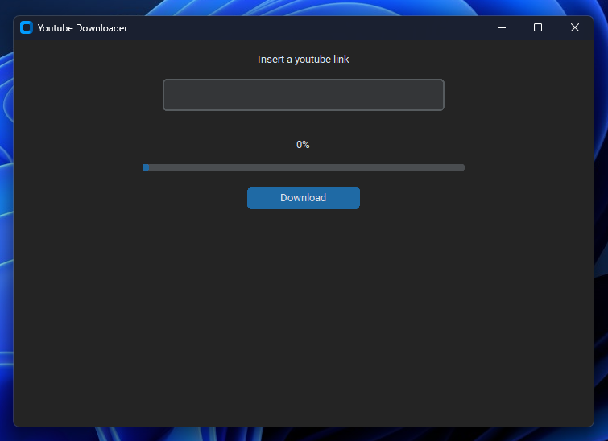

# YouTube Video Downloader GUI

This project provides a simple graphical user interface (GUI) for downloading YouTube videos using Python. The application utilizes the Pytube library and tkinter for the user interface.

## Features

- Download YouTube videos effortlessly in the highest available resolution.
- Progress tracking with a percentage indicator and progress bar.
- Customizable GUI design using the `customtkinter` module.

## Preview Video

[](youtube_downloader_demo.mp4)

Click the image above to watch a preview of the YouTube Video Downloader GUI in action!

## Requirements

Make sure you have the following prerequisites installed:

- Python 3.x
- Pytube library
- tkinter library (typically comes with Python)
- customtkinter library
- packaging library

Install the required libraries using the following command:

```bash
pip install -r requirements.txt
```

## Usage

1. Clone or download this repository to your local machine.
2. Install the required libraries as mentioned above.
3. Run the Python script `youtube_downloader.py`:

   ```bash
   python youtube_downloader.py
   ```

4. The application window will open, allowing you to input a YouTube video link.
5. Paste the URL of the YouTube video into the provided text box.
6. Click the "Download" button to start the download process.
7. Track the download progress through the displayed percentage and progress bar.
8. Upon completion, the application will indicate "Downloaded!" in green text.

## Troubleshooting

- If you encounter any issues during the download process, ensure you have a stable internet connection and a valid YouTube video link.
- For any errors or questions related to the Pytube library or the application itself, refer to the Pytube documentation or relevant resources.

## Customization

Feel free to customize the GUI design and functionality according to your preferences or requirements by modifying the `youtube_downloader.py` script. The `customtkinter` module allows for easy customization of the tkinter-based user interface.

## Disclaimer

Respect YouTube's terms of service and copyright regulations when downloading videos. Ensure you have the necessary permissions or rights to download and use the content.

## Contributing

Contributions are welcome! If you have suggestions, enhancements, or bug fixes, please create an issue or submit a pull request.
